# A Game of Classification Models

With the new season of my favorite show, Game of Thrones, making it’s debut after a two year hiatus, I thought for this project it would be fun to work with a dataset about it. The show is known to kill off characters suddenly and brutally, so in this notebook I chose to build a classification model that can predict whether a character is alive.

The dataset I’m using presents observations about 1,946 characters in the show. As with any dataset the first thing I did was load the dataset into a dataframe and then checked the head and the info

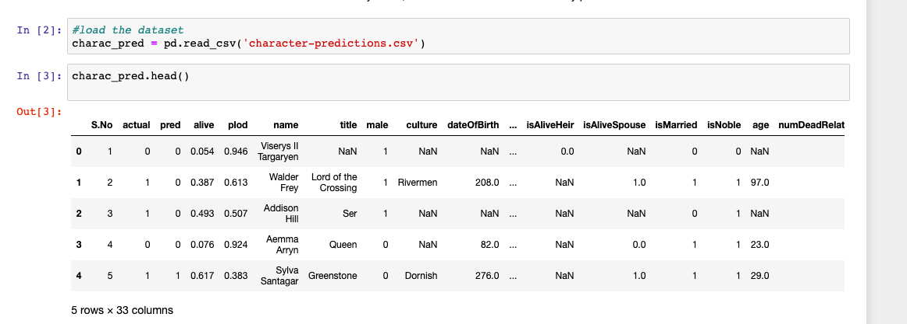

Off the bat I observed that title, culture, dateofbirth, dateofdeath, mother, father, heir, spouse, isAliveMother, isAliveFather, isliveHeir, isAliveSpouse, and age were missing way too many variables. These were dropped. On the website where I got the data from there’s no description for the variable S.no, actual, and pred so there’s were dropped as well. Finally alive was dropped for it represented the same information as isAlive. Popularity was also dropped because it is a score that is generated based on the opinion of the dataset’s author. There’s no clear rubric for this number and thereby it is arbritrary. This left us with: ‘male’, ‘house’, ‘book1’, ‘book2’, ‘book3’, ‘book4’, ‘book5’, ‘isMarried’, ‘isNoble’, ‘numDeadRelations’, ‘isPopular’, and isAlive’ as the features to work with.

Fortunately, this set did not need much cleaning, the only series that really needed one-hot encoding was ‘house.’ After dropping the null values I checked how many unique houses were represented in the dataset, it was 327! I didn’t want to create 327 so instead I painstakingly divided the houses into 13 different categories and then created categorical dummies for each of them.

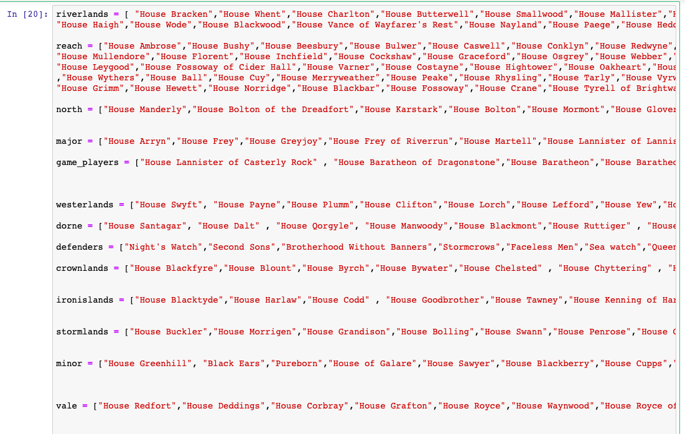
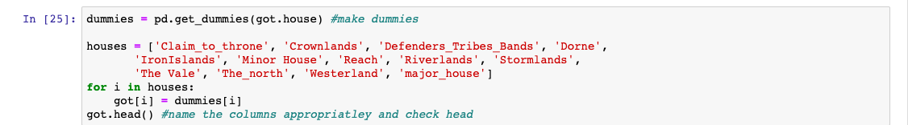

The first classification model I used was a Decision Tree. 

1) First, I identified the target and the features:

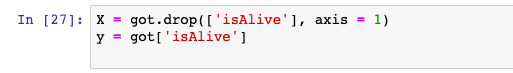

2) Then I created a split/train model with a split of 30/70 and instantiated a decision treet and fitted it to the train data to make predictions. 

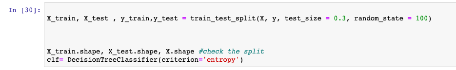

I checked the accuracy and F-1 score to each of my models, this one produced 78% accuracy and F1 score of 86%.

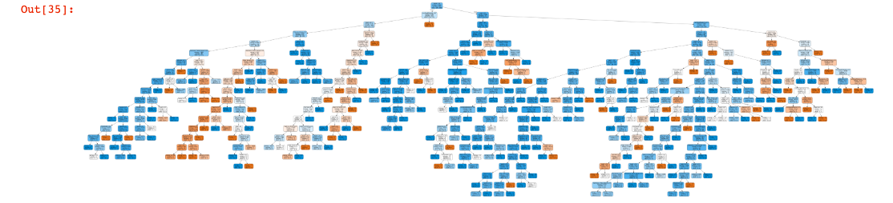

Classification models often require some fine tuning. I implemented a GridSearch to help determine which paramaters I should use for my decision tree with the following code:

1) Set paramater_grid:

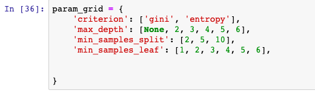

2) Use GridSearch with these paramaters:

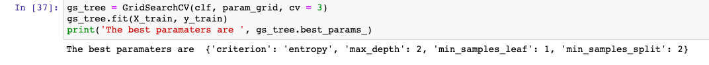

Using the paramaters that my GridSearch recommended, increased the accuracy to 80% and precision of my model to 89% while also cutting down on how many splits were made in the tree before a prediction was made.

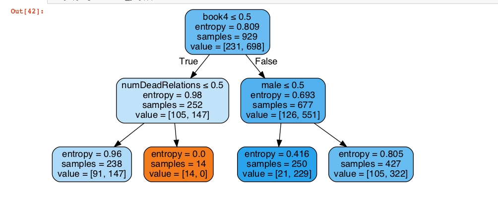

The second model I used was a randomforest model. Random forest introduce more variability in how our models learn by making several decision trees that incorporate different features for each tree and then uses the cumulative observations of each tree to make a prediction.

Creating a random forest is as easy as the following code: 

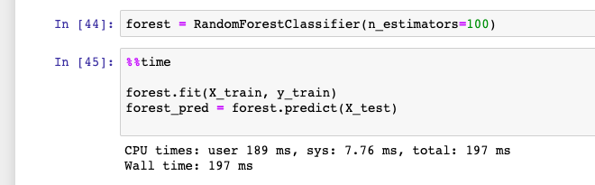

There wasn’t too much variablity in accuracy (80%) and precision (88%) compared to the Decision Trees but in order to improve efficiency I ran anothe grid search and tuned my paramaters. With tuned paramaters accuracy went up to 84% and 91%

Now, I’m currently building my models using 23 different predictors. I thought it would be more efficient to create a model where you don’t need to know as much about any given character in order to make a prediction. So  I built a function to plot feature importances:

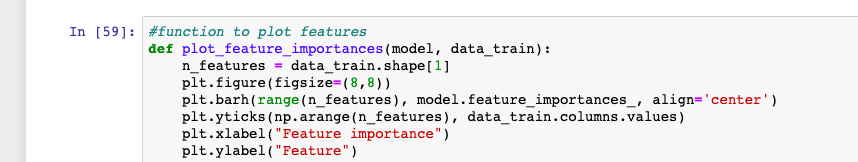

Used on my random forest, the function returned the following

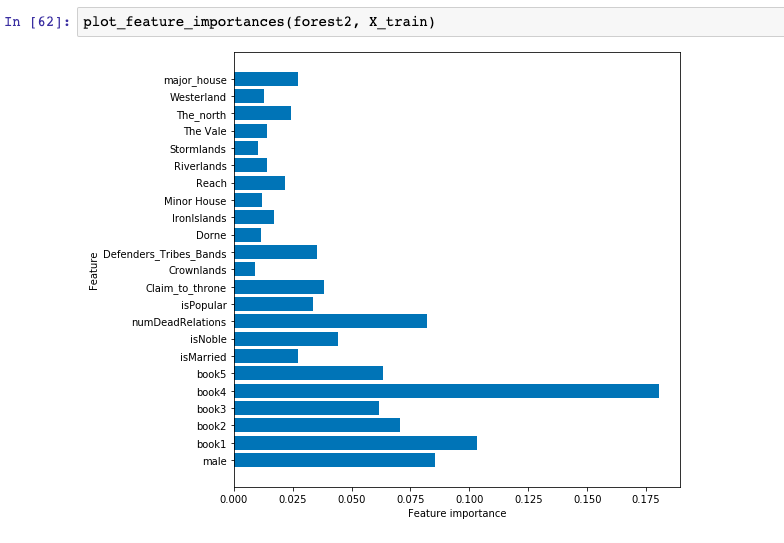

I ran a model with five fewer features and the Accuracy went up to 86% while the F1Score stayed at 91% which is very promising

Finally, I tried the popular XGBboost classification method. I reiterated the steps that I used with my first two models and used GridSearch to tune, the plot_feature_importance method to drop unimportant features, and ultimately produced a model that used 11 fewer features than the first two to make predictions at the similar levels of accuracy(82%) and precision (89%). Then I tuned the model with a GridSearch which kept models performing at the same accuracy (82%) and precision(89%) and finally I used the feature importance function to identify and drop 11 features from the model which decreased accuracy to 81% while keeping precision to about 89%.

All of my models performed at high levels of accuracy and precision but the one that out-performed them all was the Random Forest with five fewer features. 

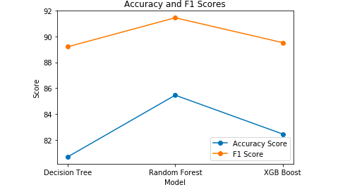

I fed the specifications of three dfferent characters to my model and got a correct prediction everytime! This was the model I ultimately chose.

